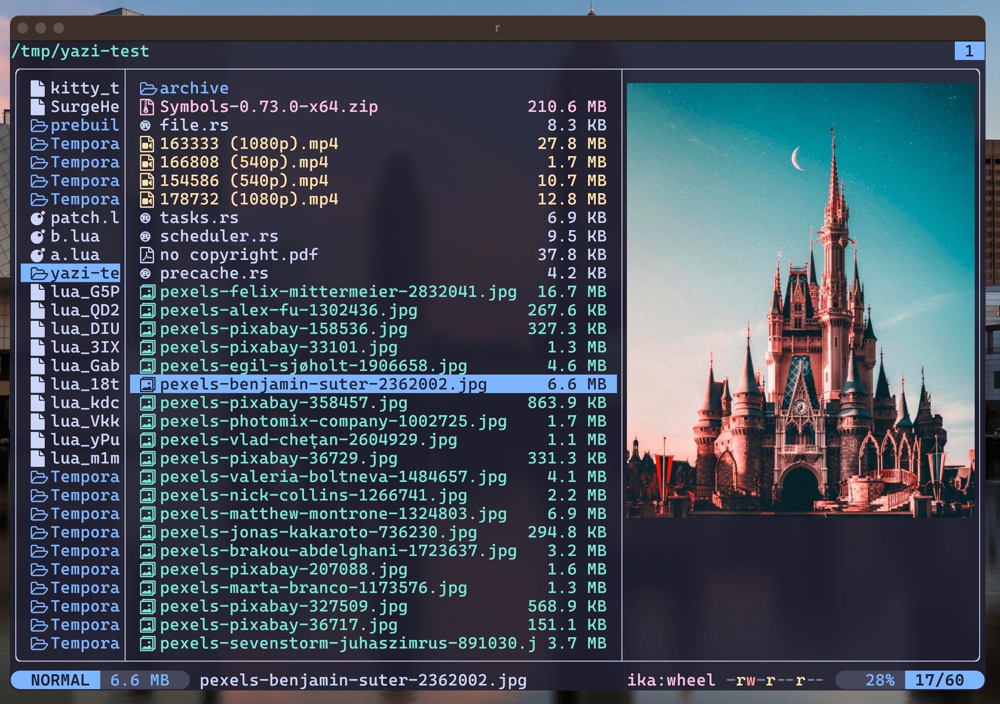

<div align="center">
  
</div>

<h3 align="center">
 eef's flavor for <a href="https://github.com/sxyazi/yazi">Yazi</a>
</h3>

## Cooking up a new flavor

> [!NOTE]
> Please remove this section from your README before publishing.

1. [x] Use this template and rename it to `your-flavor-name.yazi`.
2. [ ] Copy the **parts you need to customize** from the default [theme-dark.toml][theme-dark] or [theme-light.toml][theme-light] as `./flavor.toml`, and change them to meet your preferences.
3. [ ] Find a `.tmTheme` file on GitHub that matches the color of your flavor, copy it and its license file as `./tmtheme.xml`, and `LICENSE-tmtheme`.
4. [ ] Modify the content and preview image in the README to fit your flavor.

[theme-dark]: https://github.com/sxyazi/yazi/blob/main/yazi-config/preset/theme-dark.toml
[theme-light]: https://github.com/sxyazi/yazi/blob/main/yazi-config/preset/theme-light.toml

## 👀 Preview



## 🎨 Installation

```sh
ya pack -a Quantumplatr/eef
```

## ⚙️ Usage

To set it as your dark flavor, change the content of your `theme.toml` to:

```toml
[flavor]
dark = "eef"
```

Make sure your `theme.toml` doesn't contain anything other than `[flavor]`, unless you want to override certain styles of this flavor.

See the [Yazi flavor documentation](https://yazi-rs.github.io/docs/flavors/overview) for more details.

## 📜 License

The flavor is MIT-licensed, and the included tmTheme is also MIT-licensed.

Check the [LICENSE](LICENSE) and [LICENSE-tmtheme](LICENSE-tmtheme) file for more details.

## Notes

I copied the [.thmTheme](https://github.com/EdenEast/nightfox.nvim/blob/main/extra/terafox/terafox.tmTheme)
from EdenEast/nightfox for their terafox variant as that is what I based this
flavor on. The contents appear to be for Catppuccin Macchiato though.
